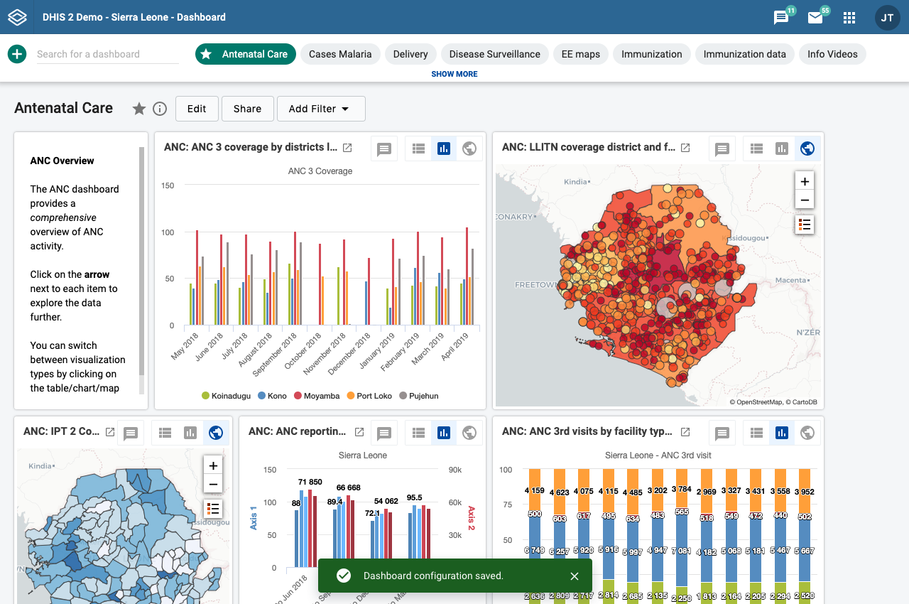

# Alert bar
A floating alert that informs the user of some temporary information in the context of the current screen. 

[Design specs for building alert bar](https://sketch.cloud/s/DwkDk/JnLkOWe)

## Composition

1. **Background, required:** background of the alert bar. The color is defined by the type.
2. **Icon, optional:** an icon to help the user quickly understand the context of the alert.
3. **Text, required:** concise, informative text. Should give the user a quick, understandable snapshot of the content in a few words.
4. **Actions, optional:** actions can be local (on the current page), or link elsewhere. An alert bar can have up to two actions.
5. **Dimiss control, required:** A control to manually dismiss the alert bar.

## Usage
Alert bars notify a user of some information. There are different types of alert bar for displaying different types of content. Use the alert bar type that matches your content type and importance. Note that alert bar can be ignored by the user, so they shouldn't be used for content that needs to block an app flow, use a [modal](modal.md) instead.

Alert bars are always displayed at centered at the bottom of the screen. Some types of alert bar dismiss after a set time, others must be dismissed by the user.

To summarise the different types of alert bar available:

Type | Usage
---- | ----
Info | Default. Inform the user of neutral content.
Success | Confirm a successful action.
Warning | Warn of a potential problem or obstruction, usually before it has happened.
Critical | Inform of a catastrophic error or problem, after it has occured.

### Using the correct type
It is important to use the correct type of alert bar. Users should not be overloaded with warnings that are not actually important, nor should they miss out on important information.

#### Info

The default alert bar that should be used in most situations. An information alert can be used to confirm minor actions instead of a success type. An info alert bar would be used, for example, for:

- "Sharing settings changed."
- "Message sent."
- "Comment edited successfully."
- "Data export complete."

Info alert bars dismiss automatically after 5 seconds, so the message should not be critical to the users understanding, but rather a useful helper.

#### Success

Success alert bars should be used to confirm successful major actions. Not all successful actions need a success alert bar, only those that are considered "large tasks", such as defining a program or creating a dashboard. Some example success alert bars:

- "Program configuration saved and updated."
- "Relationship created successfully."
- "1000 objects updated."

Success alerts dismiss automatically after 5 seconds, like info alert bars they are simply for confirmation and should not be critical to a users understanding.

#### Warning

Warning alert bars warn users of potential problems. Ideally warnings should be shown before a problem occurs. If a problem has already occured, a critical type is probably a better choice. Example content for warning alert bars:

- "Some data is taking a long time to sync."
- "A form on this page is hidden."
- "Some stages are incomplete, so this report isn't ready yet."

Warning alerts do not dismiss automatically. They disappear if the warning conditions change (eg. the data that wasn't loading finishes loading) or the user dismisses them.

#### Critical

Critical alerts are used to highlight a severe problem. They should only be used to inform the user of broken functionality after it has occured. Critical alerts should be used where the user can still interact with the application even though there is an error. If there is a catastrophic error that requires blocking the application, use a [modal](modal.md) instead. Critical alert text should inform the user what happened and why. Sample critical alert bars:

- "Dashboard failed to load."
- "Relationship not created, invalid relationship type."
- "Message failed to send because there is no connection."

Critical alerts do not dismiss automatically. A user can dismiss them.

### Text
Alert bar text should be concise and easy to understand. Avoid confusing, technical error messages. Warnings and problems should include a reason, or a recommended action to fix the problem. 

### Actions
Alert bars can have up to two actions. An action can control something on the current page (e.g. "Retry", which retries the previous action) or can link out to an external page (e.g. "View docs", which opens the relevant documentation). External actions should open in a new tab so users do not lose their current position. Alert bar actions should be simple. Do not include complex or multi-step actions.

### Icons
Alert bar icons support the content and give the user a way of quickly understanding the context of the information. Example uses of icons:

- Wifi/Network icon when informing the user about their network connection.
- Tick/checkmark when successfully adding a user.
- ! icon when an error has occured.

## Examples in use

*An alert bar confirms to the user that their dashboard was saved after they carried out changes. The changes might not be immediately visible, so it is useful to inform the user with an alert bar.*
