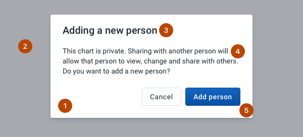
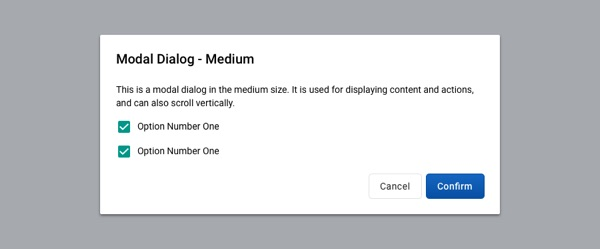

|                      |                                                                                         |
| -------------------- | --------------------------------------------------------------------------------------- |
| **Component**        | Modal                                                                                   |
| **Type**             | Molecule ([?](http://atomicdesign.bradfrost.com/chapter-2/))                            |
| **Design Spec**      | [Link](https://sketch.cloud/s/DwkDk/a/PbWMjx)                                           |
| **Working Examples** | [Link](https://d2-ci.github.io/ui-core/?path=/story/modal--medium-title-content-action) |
| **Status**           | `Ready to use`                                                                          |

---

# Modal

A modal is used for displaying information to the user in a focused environment. Modals are well suited when an application requires user input for high-intensity, contained actions.

##### Contents

- [Usage](#usage)
- [Composition](#composition)
- [Options](#options)
- [Examples in use](#examples-in-use)

---

## Usage

A modal takes over the whole screen and presents the user with a focused window. Modals are useful:

- when the application requires a user response to continue.
- if there is critical information that requires that the user take action, else something negative will occur
- if the application wants to allow for user input without leaving the current page

A modal is powerful, taking over the entire screen will break the user's flow. As described above, this can be useful. However, do not overuse modal windows, a user should not feel trapped in modal windows unless they are really required or useful. Never use modal windows just to display information, unless it is absolutely critical. Use an [alert bar](alertbar.md) for displaying information.

### Actions

Modals must always contain one or more actions. Multiple actions can be contained in an Action bar, displayed at the bottom of the modal. Alternatively an action can be inside the modal content, but make sure the action/button is obvious and easy to find. For guidance on writing clear, concise actions, see [Content and Communication guidelines](../principles/content-communication.md).

---

## Composition

A modal is made up of multiple elements, some of which are optional:

1. **Background card, required:** makes up the physical background of the modal itself
2. **Screen cover, required:** covers the screen behind the modal view
3. **Title, optional:** concise, informative title. Should give the user a quick, understandable snapshot of the content in a few words.
4. **Content, required:** the modal content itself. This can be anything, but it must be present. Empty modals are not valid.
5. **Action bar, optional:** An action bar can have a primary action or a destructive action and multiple secondary actions.
   1. **Primary action, optional:** A primary action is an affirmative button that confirms or performs an action. Examples “Confirm”, “Send email”, “Add to chart”. Primary actions always use a ‘Primary Button’
   2. **Destructive action, optional:** Similar to a primary action, but negative in nature. Destructive actions always use a ‘Destructive Button’. Examples include ‘Delete data’, ‘Remove from database’.
   3. **Secondary action, optional:** An example of a modal that includes only a ‘Secondary Button’ is a simple, informative modal that requires only an ‘Dismiss’ action.

---

## Options

### Size

Modals can be set to different sizes. Choose the appropriate modal size for your content. Mismatched sizes can make the user feel that something is missing, or that something is wrong, so choose carefully. If no size is defined, a medium modal will be used.

#### Small, 400px wide

#### Medium, 600px wide

#### Large, 800px wide

### Alignment

A modal can be aligned **top**, **middle** or **bottom**. The default alignment is top. Top aligned modals are useful when a modal may change height. A top alignment presents a consistent appearance, even if the height changes the modal is still anchored to the same point. Middle alignment is useful for single modal dialogs that do not contain dynamic content.

---

## Examples in use

_This modal in Data Visualizer app is used to set up the data included in a chart. This is a relatively complex task, so it's contained in a modal for focus. Using a modal means the user doesn't need to navigate away from the current page, an important aspect when they are working on data visualisations. Having these controls on a seperate page would feel very disconnected. Including them right on the page itself would be too messy. A modal is very useful here._

_Deleting a dashboard displays a confirmation modal. To delete a dashboard is a critical action that could have very serious consequences. The delete confirmation is presented in a modal to focus the users attention on the question: do you really want to delete this dashboard? Notice that the message text is concise and the actions are clear, there is no space for uncertainty with actions like this._
