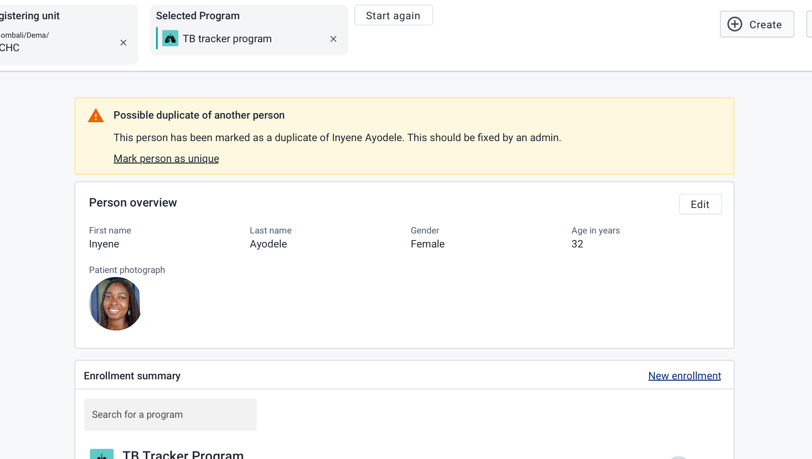

# Notice Box
The notice box component highlights useful information that is directly relevant to the page the user is viewing.

<!-- [Specs for building notice bar](https://sketch.cloud/s/DwkDk/a/Q5EqdY) -->

## Usage
Use a notice box wherever there is important information about a page or situation that the user needs to be aware of.

Notice boxes are different from [alert bars](alertbar.md) in several ways. Notice boxes cannot be dismissed, so they will always display until the situation is resolved. Notice boxes are for highlighting static information or information that is ongoing. Alert bars are suited to alerting a user about something that has just happened.

Another way to decide which component to use:

- a notice box will usually be displayed when a page loads, before a user takes action
- an alert bar will usually display in response to an action/event

Notice boxes cannot be dismissed, so it is important to provide guidance on how to fix the problem/condition that is causing the notice box to display.

## Composition

A notice box is made up of multiple elements, some of which are optional:

1. **Icon and title, required**
2. **Body text, required**
3. **Actions (maximum 2), optional**

## Actions
Notice boxes can contain up to two actions, displayed as text links.

Actions should always relate to the content of the notice box and should help to find out more information or resolve the problem that triggered the notice box.

For help writing effective action text, check out the [content and communication principles](../principles/content-communication.md).

## Types

There are three different types of notice box that are suited to different types of information.

### Information

Use an information notice box where the information is not problematic or critical, but it would still be useful for the user to know about it.

Actions are less necessary for information notice boxes. A useful action could be a link to documentation to find out  more, for example.

### Warning

Use a warning notice box to alert the user to something that is a problem, but not critical to the current workflow.

Where possible, include an action to help the user resolve the problem.

### Critical

Use a critical notice box to alert the user to a critical problem on the page/in the current context. Reserve critical notice boxes only for situations where the users path forward is blocked, or there is a problem that needs to be solved immediately.

A critical notice box should contain an action, it is important to help the user resolve a critical problem.

## Examples in use

*A warning notice box is displayed when viewing the dashboard of a person that might be a duplicate. This is not a critical problem, but it is very useful to warn the user about it. There is also a helpful action to unmark the person.*
