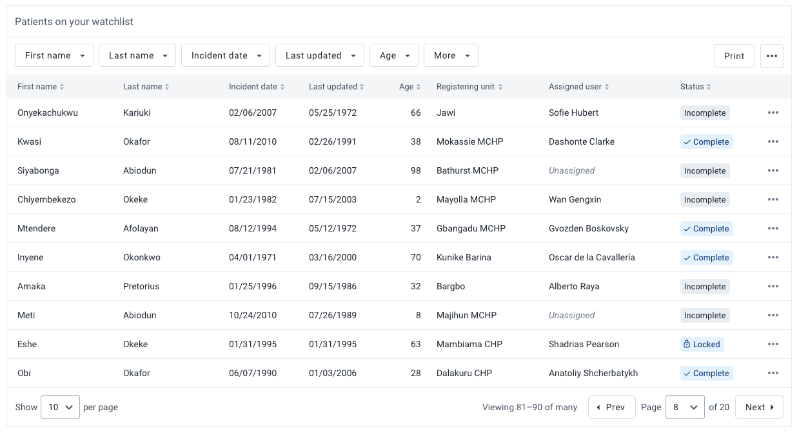
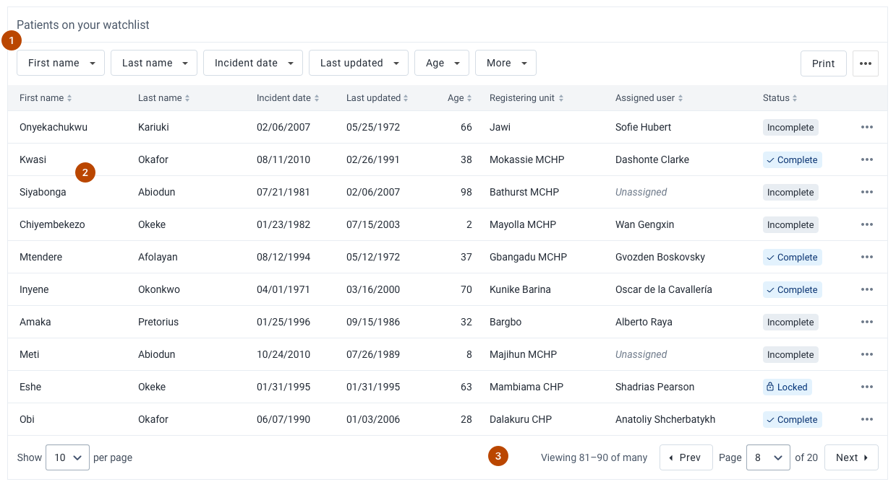
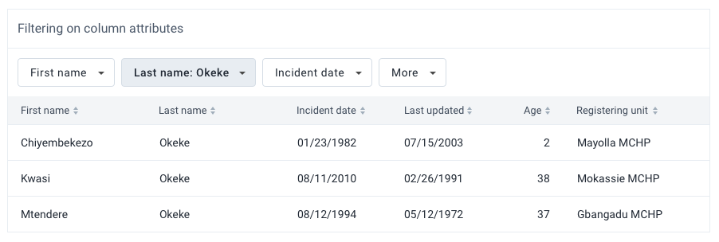
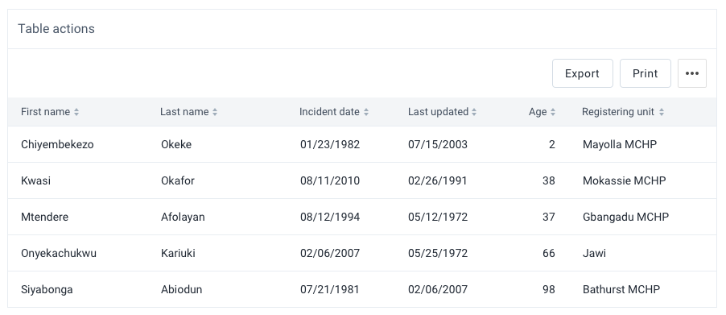
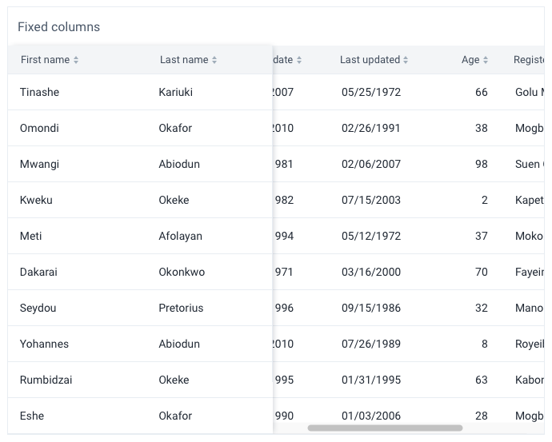
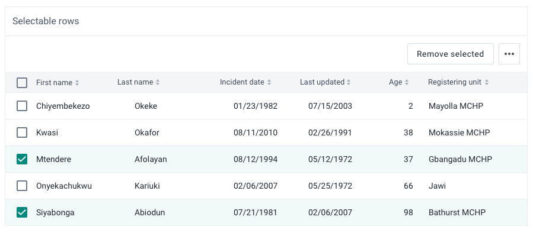

| |  |
|-------------|------------------|
| **Component** | Data table |
| **Type** | Organism ([?](http://atomicdesign.bradfrost.com/chapter-2/))|
| **Design Spec** | *pending* |
| **Working Examples** | *pending* |
| **Status** | `Work in progress` |

---

# Data table

A data table is used to display data in a structured way. Data tables have functionality for viewing and manipulating data.

##### Contents

- [Usage](#usage)
- [Composition](#composition)
- [Options](#options)
- [Types](#types)
- [States](#states)
- [Examples in use](#examples-in-use)

---

## Usage

Displaying data in a structured way aids understanding and highlights relationships in data sets. Data tables allow the user to see detailed information about data sets. Each individual record in a data table can be viewed, interacted with and manipulated.

Data tables should only be presented to the user when needed. A data table full of complex data can be overwhelming. Before using a data table, consider whether an application could parse and display the information in a more user friendly, understandable way. In cases where the user wants to see all of the data available, a data table is perfect.

There are several different types of functionality and options available in the data table component. The correct data table to use will depend on the use case and type of data being displayed. The functionality and options available in the data table component are highlighted and discussed below.

---

## Composition

A data table is made up of multiple elements, some of which are optional:

1. **Title, optional**
2. **Filters, optional**
3. **Table actions, optional**
4. **Data rows and header, required**
5. **Pagination, required**

---

## Options

### Table title

##### When to use a table title?
A title provides context to a table that might appear in a complex interface. Titles are most useful if there are multiple tables on one page. Titles are not necessary if the table comes directly after a header or other title. Titles should be short and informative. Use a title that will make sense even if the data displayed changes drastically.

---

### Filters

##### What are filters?
Filter controls allow a user to view a precise, focused set of data. If filtering is enabled the user will be able to filter each column in the table. The type of filter depends on the data type. Text can be filtered with text, numbers can be filtered by min/max and so on.

##### How are filters used?
By default the first 3 columns are displayed as filter buttons, this can be set to a custom value. Additional columns are available from the 'More' button. Clicking a filter button opens a popover with input controls. An actively filtered column is highlighted with an active button and text indicating the applied filter. Never filter data in a table without informing the user, it is important a user knows they are viewing a filtered set of data.

##### When to use filters?
Include filters in a data table when a user needs to find specific data in large data sets. Filtering is a very effective way of finding the right data. Enabling filtering on a data table means that a single data table can fulfill several different functions for varying users and use cases.

Filtering works best when a user wants to return multiple results that fit some criteria. If a user is looking for a single result, especially where they know a name/title/attribute, then provide search functionality outside of the table.

---

### Table actions

##### What are table actions?
Actions that can be applied to the entire data table, or the currently selected data rows.

##### How are table actions used?
Actions are presented as buttons in a 'table actions' area. Primary actions can be displayed as individual buttons, 'Export' and 'Print' in the example above. Other secondary options are accessed via the 'three-dot' overflow menu.

##### When to use table actions?
Only include actions here that apply directly to the data in the data table, not to the rest of the interface.

Primary actions will be very visible to the user, so only include actions here that will apply to most use cases. Edge case or rarely used options should be accessed through the overflow menu to avoid overwhelming users with options.

---

### Row actions

##### What are row actions?
Actions that can be applied to a single row in a data table.

##### How are row actions used?
Row actions are always displayed as the last column in a row. Primary row actions are displayed as text links in the row. A maximum of 2 primary row actions can be shown.  Other secondary actions are available through the 'three-dots' overflow menu.

A click action can be also be set for all rows that will be activated by clicking on that row. For example, clicking on a row may activate 'View' action and navigate to that row on a new page.

##### When to use row actions?
Primary row actions add a lot of potential action points to a page, so use them with care. Only use primary actions where that action needs to be available for all rows at all times. Secondary actions available through the overflow menu can be included anytime it is useful for users to take action when viewing the data table.

---

### Sorting/Ordering

##### What is sorting/ordering?
Sorting/ordering allows the user to reorder the rows in a data table based on a single column. The column can be sorted ascending or descending.

##### How is sorting/ordering used?
Column headings can be clicked to enable sorting by that column. The direction of sorting is indicated by a highlighted icon. Clicking a column heading multiple times toggles ascending/descending ordering.

##### When to use sorting/ordering?
Sorting is enabled by default. Only disable sorting if the order of the displayed data is intentional/meaningful and therefore should not be changed by a user.

---

### Fixed header

##### What is a fixed header?
A table header that remains in view when vertically scrolling a data table. If a table includes a title, filters or main actions these will also be fixed.

##### When to use a fixed header?
Fixed headers are useful for browsing data in limited space where the header would otherwise be hidden and users may not remember the content of each column. A fixed header ensures users always have context for the table data.

---

### Fixed columns

##### What are fixed columns?
Columns in a data table that remain in view when a table horizontally scrolls. In the above example the first two columns are fixed and the rest of the table scrolls horizontally.

##### When to use fixed columns?
Use fixed columns where space is limited and a user may need to scroll the table horizontally. Keeping a column(s) fixed helps the user to understand which row they are viewing/editing when scrolling.

---

### Inline editing

##### What is inline editing?
If enabled, cells in table rows can be edited directly in the data table without navigating to another page.

##### How is inline editing used?
If a cell is editable it will display an edit icon when the user hovers the cell/value.

Clicking an editable cell opens a popover with the input controls for editing the value. The edit must be saved, at which point any relevant validations are run.

##### When to use inline editing?
Inline editing should be used with restraint. It can be useful for power users, they can quickly edit values without leaving the data table. However, it can be overwhelming for some users, and can be particularly difficult when working with large data sets. Also consider network conditions, an unreliable network can make inline editing less clear, as the distinction between saved/failed is not always clear to a user.

---

### Expandable rows

##### What are expandable rows?
Expandable rows are table rows that can be expanded inline, without leaving the page, to reveal more information and actions.

##### How are expandable rows used?
The user can expand a row by clicking on the arrow in the left most area of the row. Alternatively, the default click action on a row could be overridden to expand the row.

##### When to use expandable rows?
Expandable rows are useful when there is a lot of useful information to display, more than would fit in a table row on a normal sized screen. A row that can expand can show this useful information to a user without leaving the page, so this pattern works well for reference screens where a user might be checking many pieces of information. Expandable rows also work well for displaying information that cannot easily be shown inside a table row: paragraphs of text or videos, for example.

---

### Selectable rows

##### What are selectable rows?
Selectable rows allow the user to select/mark one or more rows in a data table.

##### How are selectable rows used?
Rows are selected via a checkbox or radio button in each row. If using checkboxes, a checkbox control is also present in the header, clicking this checkbox selects all visible rows.

Selected rows can have actions applied to them from the Table Actions. In the above example, the 'Remove selected' button becomes active when one or more rows are selected. When no rows are selected this action is disabled. This is useful for performing actions on some, but not all rows.

If only one row can be selected the rows will have a radio button control. If multiple rows can be selected the rows will have a checkbox control.

##### When to use selectable rows?
Use selectable rows with checkboxes to allow users to perform an action on one or more rows easily. Do not enable selectable rows if there are no actions to perform.

Use a single selectable row (radio button) when a user needs to choose an option from a data table. Think carefully if a data table is the right way to display the options, would a dropdown or a simpler list work? Only use a single selectable row if the user needs to see/manipulate all of the data when making a choice.

---

### Reordering rows

##### What is row reordering?
Row reordering allows a user to drag and drop data table rows to change their order.

##### How is row reordering used?
When row reordering is enabled the primary action (e.g. clicking the row) will always activate the drag and drop functionality. If the row requires more actions they must be included as Main Actions or in the overflow menu.

##### When to use row reordering?
Row reordering should only be used where it will have a lasting, meaningful effect on the data in the data table. Do not use row reordering for temporarily sorting data in a table.

---

### Editable columns

##### What are editable columns?
Editable columns allows users to change which columns to display, and their ordering, in a data table.

##### How are editable columns used?
If column editing is enabled a button will be shown in the Table Actions. This button opens a modal view with controls for toggling on/off and reordering columns.

##### When to use editable columns?
Allowing users to edit column visibility and ordering can be useful for creating flexible data tables that need to show different data to different types of users. A single data table can fulfill many different needs and purposes.

However, do not include editable column by default. There must be an identified use case. Editing columns is advanced functionality and can be intimidating for some users, so it should be used with care.

---

### Bordered cells

Bordered cells are useful when displaying very complex data that may have similar values. For example, a table that displays only number values is best shown with borders to help visually seperate the values. Tables where rows represent one 'record' that has different value types (name, address, age, etc.) do not need borders.

---

### Built-in formatting

Several built-in text styles are available for cells. Technically any type of content can be input into a table cell, but using these styles where possible helps to build a consistent DHIS2 platform.

---

### Status badges

Status badges are a useful component to include in data tables that need to display a status for each displayed row. The 'status badge' component provides consistent styles that can be combined with custom text and icons. Use status badges where each table row has a state from a few possible shared states. Do not use status badges for unique values.

Only use status badges where the status is relevant or useful to the user. Do not use status badges unless multiple status' are available, (for example, do not use status badges if the only status ever shown is 'Active').

Use the appropriate status badge for the value. Guidelines for the different styles are:

Type  |  Usage
--|--
  |  Empty, or starting status. This could be considered the default status for a row.
  |  Useful for data is that is completed or finished, but not necessarily valid. So, it is a step beyond the 'starting' status above.
  |  Indicates the data in the row is valid. Only use where the data has been properly checked and validated, use a neutral status if the validation is unknown.
  |  There is an error or problem with the data row. Only use where this status has been properly checked/confirmed.

---

### Large cells

Large cells use a larger font-size and cell height. Use large cells where users will rarely see large amounts of data, or where users may be intimidated by compact data.

---

## States

### Empty state

An empty data table should be still communicate helpful information to a user. If there is no data to display do not simply show an empty table. Sometimes it may make sense to hide an empty table, but keep in mind that users will be unaware why the table is hidden and may be confused. In most situations it is best to show a data table with a useful empty state.

The empty state is flexible and accepts any elements, but by default it is recommended to present some informative text and an optional action. Without an action it can be difficult for the user to fix the cause of the empty data. For example, if there are no patients registered in a program, the data table is empty, the action could be 'Register a patient'.

Column headers can be displayed in an empty state if they are available, this can help the user to understand the data that would be there if the table was not empty.

---

## Examples in use

*~explain why this was the right component to use in this use case~*
