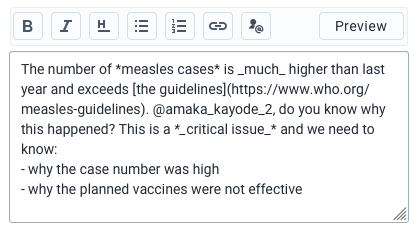
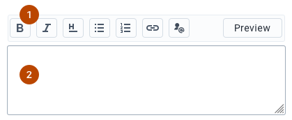
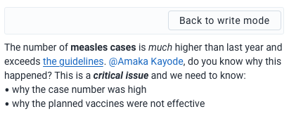

| |  |
|-------------|------------------|
| **Component** | Rich Text Editing |
| **Type** | Organism ([?](http://atomicdesign.bradfrost.com/chapter-2/))|
| **Design Spec** | [Live Spec](https://sleepy-yalow-3c0c76.netlify.com/) |
| **Working Examples** | *pending* |
| **Status** | `Waiting for build` |

---

# Rich Text Editing

Allows a user to input content with rich text features: text formatting, links, user mentions and more. Rich text editing is made possible with two components: a rich text toolbar and a rich text enabled text input.

##### Contents

- [Usage](#usage)
- [Composition](#composition)
- [Options](#options)
- [States](#states)
<!-- - [Examples in use](#examples-in-use) -->

---

## Usage

Rich text should be enabled wherever text formatting or extended text functionality would benefit the content. For example, a comment on a patient may benefit from text formatting, allowing the user to highlight the most important part of their text with bold styling. A dashboard item might also allow rich text input, where a user could add links and header text to more effectively communicate to dashboard visitors.

Rich text should not be used if there is no clear need for the functionality. Rich text should address a specific need: mentioning other users, formatting content into sections or enhancing user communication, for example. Do not use rich text where there is no meaningful benefit to the user or use case.

---

## Composition

A rich text editor contains multiple elements:

1. **Toolbar, required:** Buttons to toggle text formatting, insert links and more.
2. **Input, required:** A rich text enabled input looks the same as a regular text input, but has the extra functionality of keyboard shortcuts.

---

## Options

### Default formatting tools

The default tools available in the toolbar are: bold, italic, headers, lists and links. Individual tools can be disabled by composing a custom toolbar. Unless there is a specific reason not to, use the default toolset.

### User mentions

The user mentions tool should only be included if it would be useful to mention other DHIS2 users in the text. The mentiions tool will open a popup for searching for a user. The user mentions tool is not part of the default toolset.

---

## States

### Preview mode

Preview mode displays a formatted version of the content inside the rich text input. Preview mode can help users who are new to markdown-style writing. Preview mode is toggled via the 'Preview' button in the toolbar. While in preview mode the other formatting tools are unavailable. Do not disable saving the content while in preview mode.

<!-- --- -->

<!-- ## Examples in use -->

<!--  -->

<!-- *~explain why this was the right component to use in this use case~* -->
