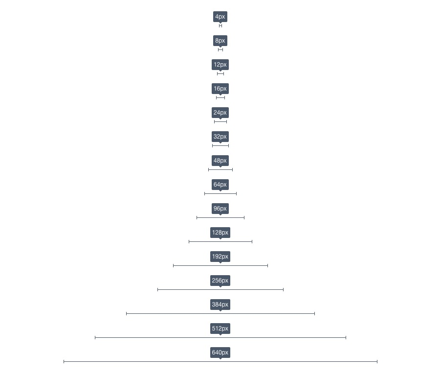
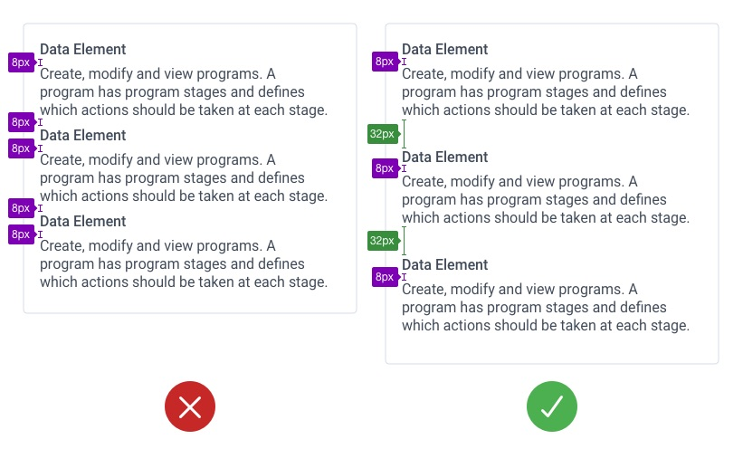
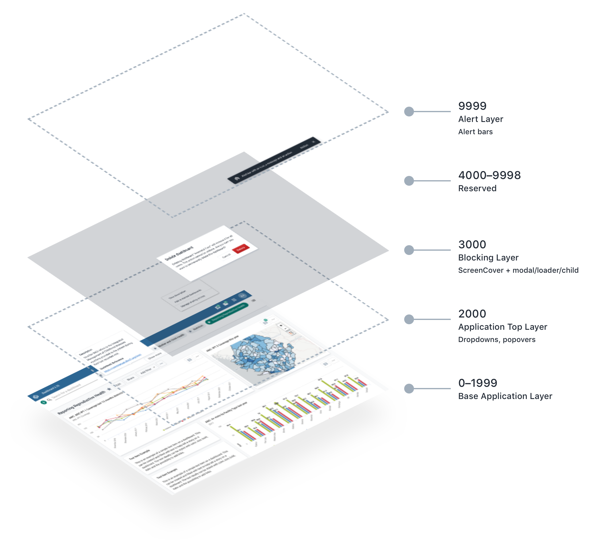

# Spacing, Alignment, Stacking

## Spacing between elements

Similar to the typographic scale, it is useful to have a spacing scale. This serves a similar purpose of building consistency and giving reasonable defaults that fit most situations. 

The spacing scale is:  4, 8, 12, 16, 24, 32, 48, 64, 96, 128, 192, 256, 384, 512, 640

The spacing scale can be used for spacing between elements, padding inside an element or pretty much anywhere where an amount of space is needed for division. Having these set values, like font sizes, removes some of the confusion when trying to decide if something looks better 1px up or down, simply choose a unit from the scale, if that is too little or too much then go to the next value on the scale. There is of course a small trade-off in flexibility using this system, but the payoffs in time saved and simplicity are worth it.

It is important to note that the spacing system is a set of guidelines, it should be used wherever possible. There will be situations where the perfect value is not on the scale, if that is really the case then use a custom value. But more often than not, a value from the scale will be sufficient. 

## Using spacing

A good way to think of spacing is to see it as just another user interface element that fulfills a purpose. Spacing should be intentional, not just the leftover emptiness that wasn't used by elements.

Thinking about a regular form, spacing can be used effectively to help the user understand the relationship between elements of the form. See the example below. Elements of the same section use 8px spacing. To indicate the end of a section and the start of another we can use 32px spacing. Without even reading the section headers the user is aware of the information architecture. Now the user can understand that the label belongs to the form field that it is closest to. Here we can see how we are actively using spacing to define relationships, we don't solely rely on vertical order to communicate which header belongs to which content.

*Adding more spacing in between separate elements than within the elements themselves is an easy way of communicating relationships*

## How much space to use?

Yes, the age old question. How much space to use, how much white space is enough, what if the user wants to see everything at once? You can probably guess what I'm going to say...there is no strict rule or formula!

The density of information, how much we show at once and how it is spaced out, does depend on the intended use of the application. Dashboards usually need high information density because the user wants to see a lot of information in a snapshot view. Forms are harder, a form that is filled out occasionally benefits from a loose information density, new questions and inputs won't overwhelm the user the first time they see them. A form that is used many times a day could benefit from dense inputs, the user knows what they are doing and wants to see as much of their work on screen as possible.

So it is important to understand the intended usage of the interface when deciding how much spacing is enough, or whether to stack things or put them in columns. DHIS2 is especially difficult because it can be used for so many different use cases and they all have different requirements. In this case, we have to do our best to cater to the majority of intended use cases. Speak with the project owner and see if they can offer guidance.

If in doubt, try to strike a balance between compact and 'spaced out'. Don't artificially make the page run longer than it needs to, but also don't be afraid to let the elements breath. I realise I've now entered the realm of cliched personifications of user interfaces, so I'll stop. Don't hesitate to reach out to me with a screenshot and simple "too much or not enough space?".

## Stacking
It's important to maintain an understandable and consistent stacking system across all DHIS2 apps. "Stacking" refers to the concept of layering components on top of one another. For example, a modal window is stacked on top of regular application content. This communicates that a modal window interrupts the app flow for a different type of content.  The DHIS2 Design System defines 5 layers in the stack:

Layer | Description
------------ | -------------
Base Application Layer (0–1999) | Contains all components, controls and data for the main application. The application can define it's own layering from 0 to 1999.
Application Top Layer (2000) | Protected components that always layer over the top of the base application layer. This layer is reserved for controls such as dropdowns and popovers that functionally must always display above the application content.
Blocking Layer (3000) | Blocks the application and its controls, so is only use for actions that are intentionally interrupting. This layer contains a sceen cover which blocks the layers beneath. Child elements, such as [modals](../molecules/modal.md) or loaders, can be added to this layer.
Reserved (4000–9998) | Reserved for future development.
Alert Layer (9999) | The top layer is reserved for displaying [alert bars](../molecules/alertbar.md). Alert bars can contain critical information and so must always be displayed above all other content.

### Using stacking
All layers above 1999 are protected and should not be used for application components and controls. When building your application it may be necessary to define your own system between 0–1999. Keep in mind how users perceive different layers. Layers at the 'top' of a stack will always seem most important. Placing content on different layers may obscure information in some cases, always be aware of the consequences of stacking. If in doubt it is safer to place content on the same layer than risk overlapping, unclear layouts.