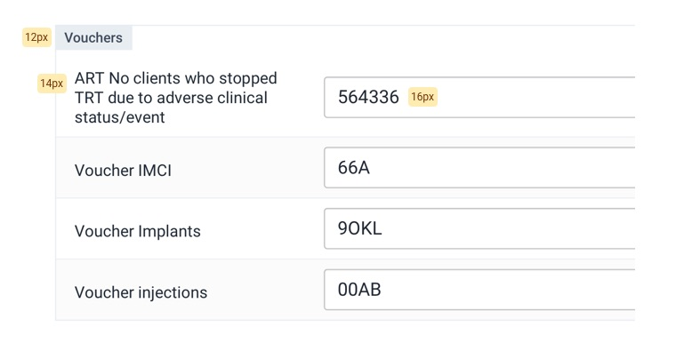
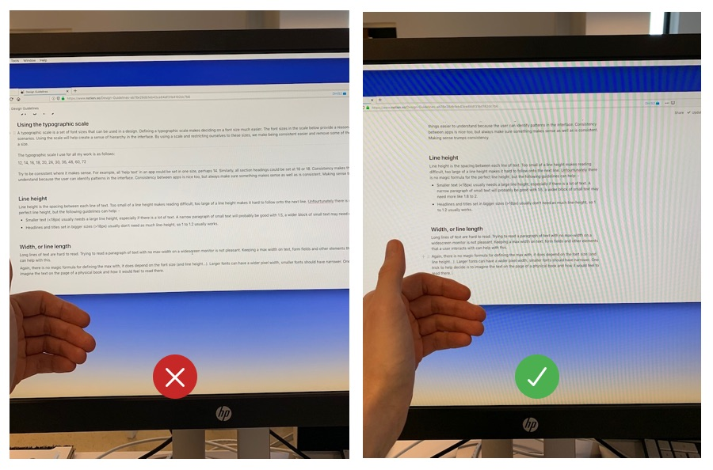

# Typography

## Type styles
Use the available type styles for formatting text. The styles are based on a typographic scale that provides an adequate size for the majority of situations. The type scale is based on 16px as the base font size. Remember to consider the information hierarchy when using these styles.

#### The type scale

class | size
--- | ---
`t12` | `0.75rem`
`t14` | `0.875rem`
`t16` | `1rem`
`t18` | `1.125rem`
`t20` | `1.25rem`
`t24` | `1.5rem`
`t30` | `1.875rem`
`t36` | `2.25rem`
`t48` | `3rem`
`t60` | `3.75rem`
`t72` | `4.5rem`

#### Using the scale
Each size step in the type scale can be used by setting the relevant class on an element. Each size is set up with appropriate line-height and letter-spacing values, so make sure to use the relevant class rather than defining sizes manually.

### Communicating with typography

#### Hierarchy
The typographic scale has a built-in hierarchy, smaller font sizes should naturally be applied to less important information and larger sizes are more suited to headers, titles and critical content.
<!-- todo simple hierarchy example -->

#### Emphasis
However, sometimes a more subtle contrast is required than the difference between 20px and 24px. This can be achieved through the use of different font weights. Font weights are not specified by the type scale. For the sake of flexibility, each step in the scale can be used in any weight. The same font size in Regular and Bold weights, when used side by side, occupy different places in the information hierarchy.

#### Line length
Long lines of text are hard to read. Trying to read a paragraph of text with no max-width on a widescreen monitor is not pleasant. Keeping a max-width on text, form fields and other elements that a user interacts with can help with this.

Again, there is no magic formula for defining the max with, it does depend on the font size (and line-height...). Larger fonts can have a wider pixel width, smaller fonts should have narrower. One trick to help decide is to imagine the text on the page of a physical book and how it would feel to read there. A book page that spanned the width of our widescreen monitors would be impossible to follow, the lines are too long.

*Imagine trying to read a book where the pages were 'widescreen' size. The lines are hard to follow.*

This applies mostly to longer blocks of content, but it is still relevant to forms and other inputs. Often there is no need to let dropdown menus or text inputs span 100% width of the screen. Setting a reasonable max-width helps keep the content tidy and organized.
